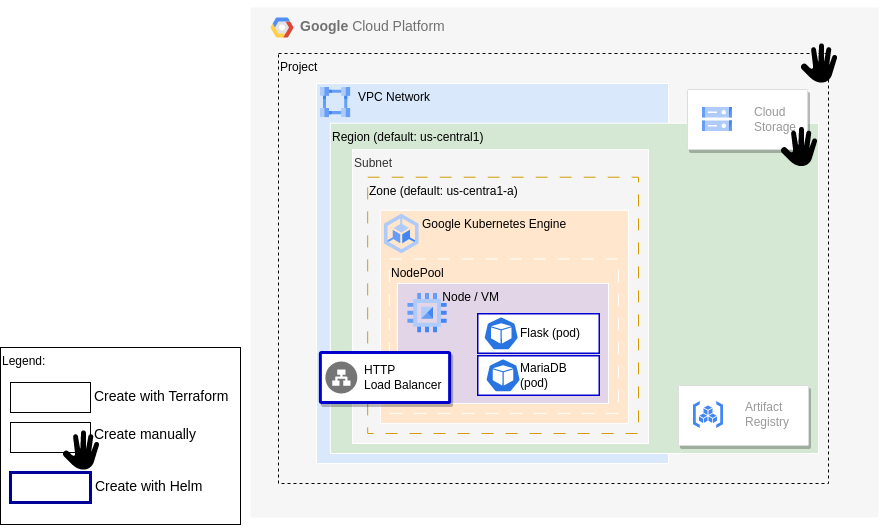
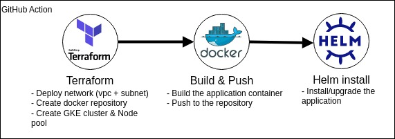

# Overweight-hello-world

## Introduction

This project aim to show a full, but simple, CI/CD that deploy an application on Kubernetes. It is made to run on Google Cloud and cost almost nothing if you don't already use your [GCP free tier](https://cloud.google.com/free/docs/free-cloud-features)

## Architecture



## CI/CD

It's using GitHub action as CI/CD tool.

This deployment workflow is executed when a push on the main branch is done:



> There is also a cleaner workflow to clean your infrastructure when you've finished. You have to execute it manually from the tab "Actions" of your project. (/!\ this workflow don't delete the project, the cloud storage and the service account)

## Requirements / Preparation

### GCP

#### Create a project (Optional)

If you don't have a project available, please [create one](https://cloud.google.com/resource-manager/docs/creating-managing-projects).

**Note your project ID for later**

#### Enable the API

By default all the API required aren't enabled on the project, please be sure to [enable the API](https://cloud.google.com/endpoints/docs/openapi/enable-api):

* Compute Engine API
* Cloud Monitoring API
* Artifact Registry API
* Kubernetes Engine API
* Cloud DNS API
* Cloud Logging
* Cloud Autoscaling API

#### Create a service account & its key

The service account will be used by Github to do all the necessary action on GCP. 

1. Please [create a service account](https://cloud.google.com/iam/docs/service-accounts-create) with the following roles:

* Artifact Registry Administrator
* Compute Admin
* Kubernetes Engine Admin
* Network Management Admin
* Service Account User
* Storage Admin

2. [Create a new key in json format](https://cloud.google.com/iam/docs/keys-create-delete) for this service account.

**Download the json key file and keep it for later**

#### Create a bucket

To store the tfstate of terraform, we need a Bucket in Cloud Storage. Please create one with the following information:

* Put the <\Name\> you want
* Set Region: us-central1 (if you plan to keep the default configuration)
* Keep "Set a default class" as "Standard"
* Keep default "Enforce public access prevention on this bucket" selected
* Keep default access control at "Uniform"
* keep default projection tools at "None"

**Note your bucket name for later**

### GitHub

#### Create new repository

Please [create a new repository](https://docs.github.com/en/repositories/creating-and-managing-repositories/creating-a-new-repository) with a branch "main"

#### Set Variables for GitHub Actions

We need few secret & variables to run the project, [please create them](https://docs.github.com/en/actions/security-guides/encrypted-secrets?tool=webui):

|  Type  | Name             | Secret/value                         |
|--------|------------------|--------------------------------------|
| secret | GCP_ACCESS_TOKEN | copy the content of the access key .json |
|variable| GOOGLE_PROJECT   | copy your project id                 |
|variable| GOOGLE_REGION    | us-central1 *                        |
|variable| GOOGLE_ZONE      | us-central1-a *                      |
|variable| GOOGLE_BUCKET    | Bucket name created previously       |

\* default parameters with which it was tested

## Try it

### Computer preparation

1. Clone your repository

```sh
git clone <your repository>
```

2. Copy zip content in the folder (local repository)

### Execute (do git push)

```sh
git add .
git commit -m "my app on gcp"
git push
```

### Watch

1. [Github] In the tab "Actions", a workflow "deployment" will appear with a run name of your commit message.
2. [Github] If you select it, you will see the name of the jobs (describe previously). You can click on each job to see details.
3. [GCP] The 1st job should create in order: VPC, subnet, artifact registry, Kubernetes Engine (GKE), container node pool, compute.(The GKE part should take few minutes).
4. [GCP] At the end of the 2nd job, a image should be available in the artifact registry.
5. [GCP] The 3rd job will deploy the application. In the view Services&Ingress of GKE, you should see an ip address to see the application ``123.123.123.123:80/``. Even if the service is available it's possible that the deployment take some time because the default node type is really slow (to stay in [GCP free tier](https://cloud.google.com/free/docs/free-cloud-features)).
6. Open the address in a browser, you should see this:

```txt
Hello World!

We retrieve the prefectures & capitals from the db :

    Aichi -> Nagoya
    Akita -> Akita
    Aomori -> Aomori
    Chiba -> Chiba
    Ehime -> Matsuyama
    Fukui -> Fukui
    Fukuoka -> Fukuoka
    Fukushima -> Fukushima
    Gifu -> Gifu
...
```

### Idea to try

Edit some files and see the change after commit.

#### Use a better compute type for the node

* Idea 1) Edit line 51 of ``terraform/variables.tf``:

```terraform
...
variable "gke_node_type" {
    type    = string
    description = "Compute Type for the nodes"
    default = "<your new type>"
}
...
```

* Idea 2) add env var to CI/CD to set it. Edit line 21 of ``.github/workflow/workflow.yaml``:

```yml
...
    env:
      GOOGLE_CREDENTIALS: ${{ secrets.GCP_ACCESS_TOKEN }}
      GOOGLE_BUCKET: ${{ vars.GOOGLE_BUCKET }}
      TF_VAR_GCP_PROJECT_ID: ${{ vars.GOOGLE_PROJECT }}
      TF_VAR_GCP_PROJECT_REGION: ${{ vars.GOOGLE_REGION }}
      TF_VAR_GCP_PROJECT_ZONE: ${{ vars.GOOGLE_ZONE }}
      TF_VAR_gke_node_type: <your new type>
...
```

#### Change the application

* Idea 1) Change the version of the application in file ``app/__version__``
* Idea 2) Change the Hello world text line 55 of ``app/hello.py`` (please also do Idea 1):
```yml
...
@server.route('/')
def hello():
    reply =  "<h1>Hello <your new message></h1>"
    reply += "<p>We retrieve the prefectures & capitals from the db :"
    reply += "<ul>"
...
```
* Idea 3) Change the content of database, line 52 of ``app/data.py`` (please also do Idea 1):
```yml
prefecture = {
    "<add something>":"<add something>",
    "Aichi":"Nagoya",
    "Akita":"Akita",
...
```

### Clean and retry

Without making any change in the code, it's possible to clean and retry from the GitHub Actions tab.

1. Clean: Select **terraform cleaner** workflow and click **Run workflow** (on main branch).
2. Re-run the deployment:  Select **deployment** workflow, click on the last workflow run and  click **Re-run all jobs**.
